# 네입클로버 - 현지인의 맛집 추천과 편리한 정산 서비스

<div align="center">
  
  <p>현지인과의 성공적인 여행, 편리한 정산</p>
</div>

## 프로젝트 소개
네잎클로버는 여행 동행자를 초대하고, 여행 계획을 관리하며, 여행 경비를 정산할 수 있는 올인원 여행 서비스입니다. 현지인 매칭을 통해 맛집 추천 서비스를 제공하며, 플러터로 개발된 모바일 애플리케이션으로 사용자에게 직관적이고 사용하기 쉬운 인터페이스를 제공합니다.

## 프로젝트 기간
- 개발 기간: 2024.03.12 ~ 2024.04.11 (4주)
- 기획 및 설계: 2주
- 개발 및 테스트: 2주

## 주요 기능 데모
### 1. 사용자 인증 및 프로필
<div style="display: flex; justify-content: space-between;">
  <div style="flex: 1; margin-right: 10px;">
    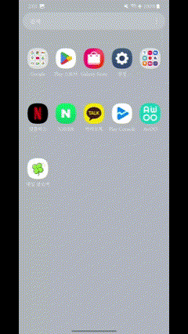
    <p>카카오 소셜 로그인</p>
  </div>
  <div style="flex: 1; margin-right: 10px;">
    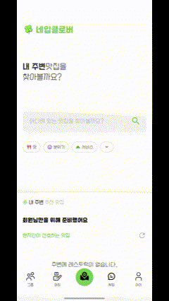
    <p>마이페이지 및 소비패턴 분석</p>
  </div>
</div>

### 2. 그룹 및 여행 계획
<div style="display: flex; justify-content: space-between;">
  <div style="flex: 1; margin-right: 10px;">
    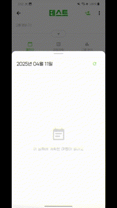
    <p>그룹 생성 및 관리</p>
  </div>
  <div style="flex: 1; margin-right: 10px;">
    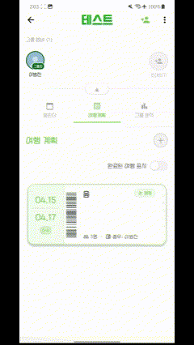
    <p>그룹 상세 정보</p>
  </div>
  <div style="flex: 1;">
    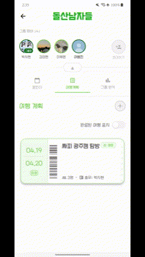
    <p>그룹 여행 계획</p>
  </div>
</div>

### 3. 매칭 및 현지인 연결
<div style="display: flex; justify-content: space-between;">
  <div style="flex: 1; margin-right: 10px;">
    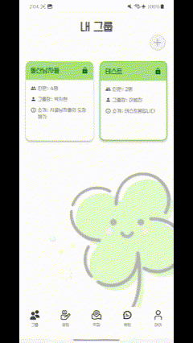
    <p>동행 매칭 시스템</p>
  </div>
  <div style="flex: 1;">
    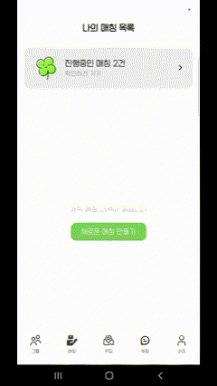
    <p>현지인 매칭</p>
  </div>
</div>

### 4. 결제 및 정산
<div style="display: flex;">
  <div style="flex: 1;">
    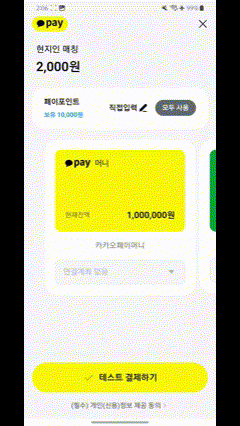
    <p>간편 결제 시스템</p>
  </div>
</div>

### 5. 리뷰 및 평가
<div style="display: flex;">
  <div style="flex: 1;">
    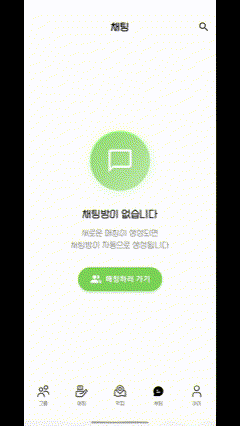
    <p>사용자 리뷰 시스템</p>
  </div>
</div>

### 6. 지도 및 검색
<div style="display: flex;">
  <div style="flex: 1;">
    
    <p>위치 기반 검색</p>
  </div>
</div>

### 7. 채팅
<div style="display: flex;">
  <div style="flex: 1;">
    
    <p>실시간 채팅</p>
  </div>
</div>

## 주요 스크린샷
<div align="center">
  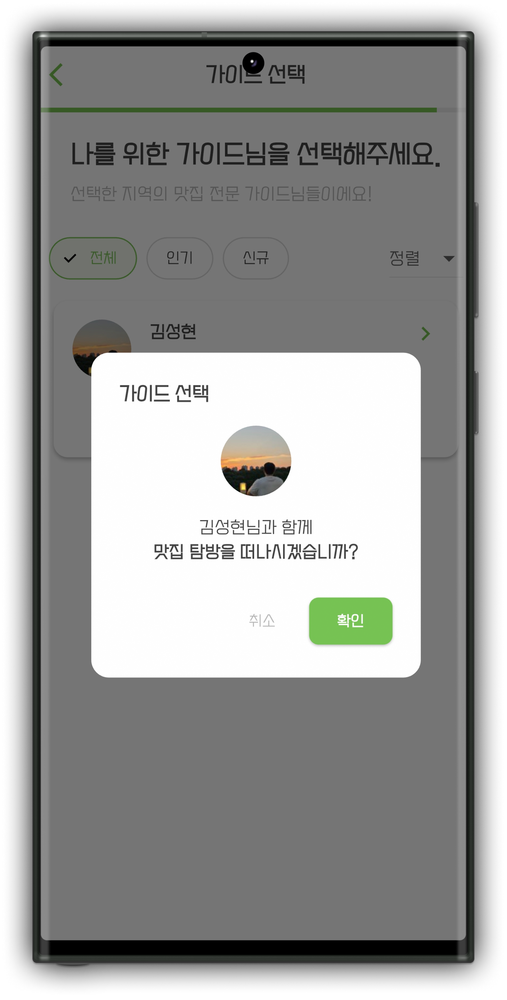
  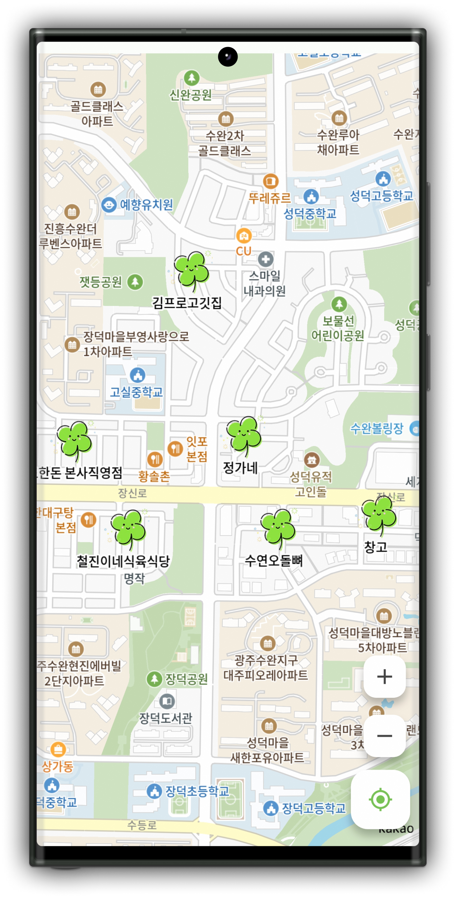
  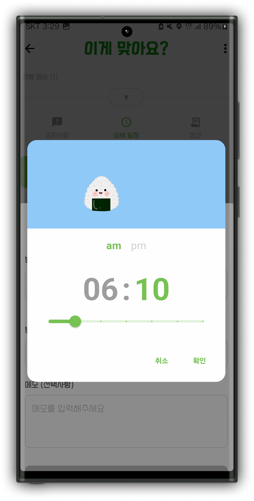
</div>

## 시스템 아키텍처
<div align="center">
  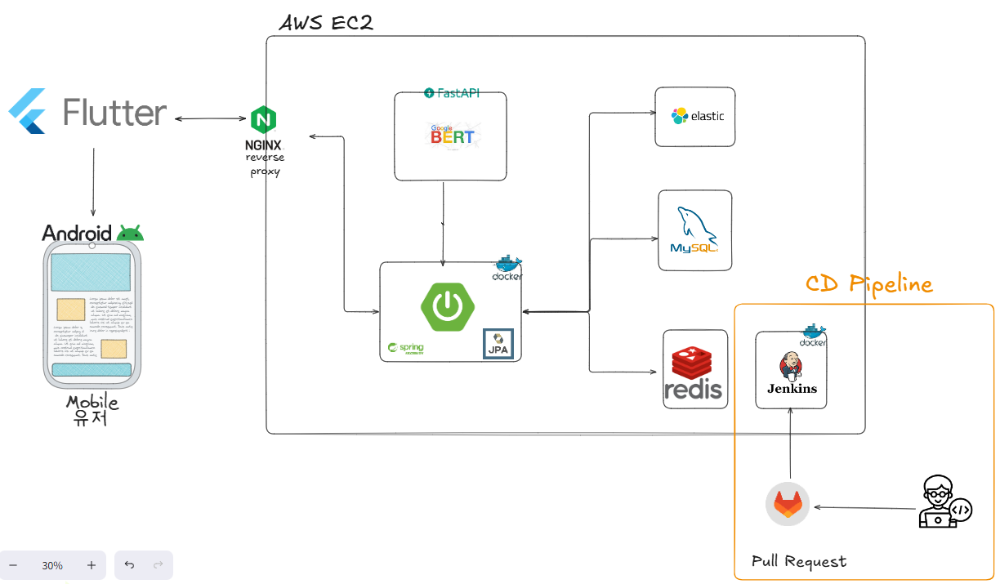
</div>

### 기술 스택 상세
- **프론트엔드**
  - Flutter: 크로스 플랫폼 모바일 애플리케이션 개발
  - Android SDK: 안드로이드 네이티브 기능 구현

- **백엔드**
  - Spring Boot: RESTful API 서버 구현
  - JPA: 객체-관계 매핑(ORM)
  - FastAPI: BERT 모델 서빙을 위한 API 서버
  - NGINX: 리버스 프록시 서버

- **데이터베이스**
  - MySQL: 메인 관계형 데이터베이스
  - Redis: 캐싱 및 세션 관리
  - Elasticsearch: 검색 엔진

- **인프라**
  - AWS EC2: 클라우드 서버 호스팅
  - Docker: 컨테이너화 및 배포
  - Jenkins: CI/CD 파이프라인
  - GitLab: 버전 관리 및 협업

### 주요 특징
- NGINX를 통한 효율적인 로드 밸런싱
- Docker 컨테이너를 활용한 마이크로서비스 아키텍처
- Jenkins를 통한 자동화된 빌드 및 배포
- BERT 모델을 활용한 사용자 매칭 시스템
- Redis를 활용한 성능 최적화
- Elasticsearch를 통한 효율적인 검색 기능

## 기술 스택
- **프레임워크**: Flutter
- **상태관리**: Provider
- **언어**: Dart
- **통신**: HTTP, RESTful API
- **인증**: JWT, Kakao SDK
- **지도 서비스**: Kakao Maps
- **결제 시스템**: PortOne
- **데이터 저장**: Shared Preferences, Flutter Secure Storage
- **차트**: FL Chart
- **UI 컴포넌트**: Material Design, Custom Widgets

## 주요 기능
- **사용자 인증**: 카카오 로그인 연동, JWT 기반 인증 시스템
- **여행 동행 매칭**: 취향과 일정에 맞는 여행 동행자 검색 및 매칭
- **여행 계획 관리**: 일정 작성, 장소 추가, 메모 기능
- **실시간 정산**: 그룹 내 비용 분담 및 정산 시스템
- **지도 기능**: 여행 장소 탐색 및 검색
- **리뷰 시스템**: 동행자 리뷰 및 평가
- **알림 기능**: 중요 이벤트 및 메시지 알림

## 화면 구성
- 온보딩 화면
- 로그인/회원가입
- 홈 화면
- 검색 결과
- 지도 화면
- 그룹 계획
- 결제 화면
- 채팅
- 프로필 관리
- 리뷰 화면

## 아키텍처
본 프로젝트는 Provider 패턴을 사용하여 상태를 관리하며, 다음과 같은 구조로 설계되었습니다:
- **models**: 데이터 모델 정의
- **providers**: 상태 관리 로직
- **screens**: UI 화면
- **widgets**: 재사용 가능한 UI 컴포넌트
- **services**: API 통신 및 외부 서비스 연동
- **utils**: 유틸리티 함수
- **constants**: 상수 값 정의
- **config**: 앱 설정 및 라우팅

## 개발 환경 설정
1. Flutter SDK 설치 (3.7.0 이상)
2. 프로젝트 클론
   ```
   git clone [저장소 URL]
   ```
3. 의존성 설치
   ```
   flutter pub get
   ```
4. .env 파일 설정 (API 키 등 환경 변수)
5. 앱 실행
   ```
   flutter run
   ```

## 배포 정보
- Android & iOS 지원
- 최소 Android API 레벨: 21 (Android 5.0)
- 최소 iOS 버전: iOS 12.0

## 프로젝트 구조
```
frontend/
├── assets/                   # 앱에서 사용하는 리소스 파일
│   ├── images/               # 이미지 리소스
│   ├── icons/                # 아이콘 리소스
│   ├── fonts/                # 폰트 파일
│   └── test/                 # 테스트 데이터
├── lib/                      # 소스 코드
│   ├── config/               # 앱 설정 및 환경 변수
│   │   ├── api_config.dart   # API 관련 설정
│   │   ├── kakao_config.dart # 카카오 SDK 설정
│   │   ├── routes.dart       # 앱 라우팅 설정
│   │   └── theme.dart        # 앱 테마 설정
│   │
│   ├── constants/            # 상수 정의
│   │
│   ├── models/               # 데이터 모델
│   │   ├── user_model.dart   # 사용자 모델
│   │   ├── chat_model.dart   # 채팅 관련 모델
│   │   ├── review_model.dart # 리뷰 모델
│   │   ├── route_model.dart  # 경로 모델
│   │   ├── restaurant_model.dart # 음식점 모델
│   │   ├── settlement/       # 정산 관련 모델
│   │   ├── plan/             # 계획 관련 모델
│   │   ├── group/            # 그룹 관련 모델
│   │   ├── matching/         # 매칭 관련 모델
│   │   └── analysis/         # 분석 관련 모델
│   │
│   ├── providers/            # 상태 관리
│   │   ├── app_provider.dart        # 앱 전체 상태 관리
│   │   ├── auth_provider.dart       # 인증 관련 상태 관리
│   │   ├── group_provider.dart      # 그룹 관련 상태 관리
│   │   ├── map_provider.dart        # 지도 관련 상태 관리
│   │   ├── plan_provider.dart       # 계획 관련 상태 관리
│   │   ├── settlement_provider.dart # 정산 관련 상태 관리
│   │   ├── search_provider.dart     # 검색 관련 상태 관리
│   │   ├── user_provider.dart       # 사용자 관련 상태 관리
│   │   ├── matching_provider.dart   # 매칭 관련 상태 관리
│   │   ├── review_provider.dart     # 리뷰 관련 상태 관리
│   │   ├── notice_provider.dart     # 알림 관련 상태 관리
│   │   └── tag_provider.dart        # 태그 관련 상태 관리
│   │
│   ├── screens/              # UI 화면
│   │   ├── ai/               # AI 관련 화면
│   │   ├── album/            # 앨범 관련 화면
│   │   ├── auth/             # 인증 관련 화면
│   │   ├── chat/             # 채팅 관련 화면
│   │   ├── common/           # 공통 화면 요소
│   │   ├── group_plan/       # 그룹 계획 관련 화면
│   │   ├── home/             # 홈 화면
│   │   ├── map/              # 지도 관련 화면
│   │   ├── matching/         # 매칭 관련 화면
│   │   ├── onboarding/       # 온보딩 화면
│   │   ├── payment/          # 결제 관련 화면
│   │   ├── review/           # 리뷰 관련 화면
│   │   ├── search_results/   # 검색 결과 화면
│   │   ├── splash/           # 스플래시 화면
│   │   └── user/             # 사용자 프로필 관련 화면
│   │
│   ├── services/             # API 서비스
│   │   ├── api/              # API 통신 관련 서비스
│   │   ├── auth_service.dart # 인증 관련 서비스
│   │   ├── user_service.dart # 사용자 관련 서비스
│   │   ├── chat_service.dart # 채팅 관련 서비스
│   │   ├── invitation/       # 초대 관련 서비스
│   │   ├── kakao/            # 카카오 관련 서비스
│   │   ├── matching/         # 매칭 관련 서비스
│   │   ├── payment/          # 결제 관련 서비스
│   │   ├── review_service.dart # 리뷰 관련 서비스
│   │   └── restaurant_service.dart # 음식점 관련 서비스
│   │
│   ├── utils/                # 유틸리티 함수
│   │
│   ├── widgets/              # 재사용 UI 컴포넌트
│   │   ├── common_widgets.dart       # 공통 위젯
│   │   ├── custom_switch.dart        # 커스텀 스위치 위젯
│   │   ├── kakao_map_native_view.dart # 카카오맵 네이티브 위젯
│   │   ├── loading_overlay.dart      # 로딩 오버레이 위젯
│   │   ├── skeleton_loading.dart     # 스켈레톤 로딩 위젯
│   │   ├── toast_bar.dart            # 토스트 메시지 위젯
│   │   └── clover_loading_spinner.dart # 로딩 스피너 위젯
│   │
│   └── main.dart             # 앱 엔트리 포인트
│
├── android/                  # Android 관련 설정
├── ios/                      # iOS 관련 설정
├── test/                     # 테스트 코드
└── pubspec.yaml              # 의존성 관리
```

## 팀 구성
- **프론트엔드 개발,디자이너**: [이범진,윤희준,이채원] - Flutter/Dart 개발, UI/UX 구현
                                                    - UI/UX 디자인, 그래픽 리소스
- **백엔드 개발**: [김성현,김시현] - API 개발, 서버 관리
- **빅데이터 개발**: [김시원] - 빅데이터 개발 (개별소비패턴)
## 담당 업무 (프론트엔드)
- Provider 패턴을 활용한 상태 관리 구현
- 카카오 소셜 로그인 및 지도 API 연동
- 사용자 인증 및 토큰 관리 구현
- 반응형 UI 디자인 및 애니메이션 구현
- HTTP 통신 및 API 연동
- 결제 시스템 연동

## 성과 및 배운 점
- 복잡한 상태 관리를 위한 Provider 패턴 활용 경험
- 외부 API 연동 및 OAuth 인증 구현 경험
- 사용자 경험을 최우선으로 한 UI/UX 설계
- 코드 리팩토링을 통한 성능 최적화
- 현지인 매칭 시스템을 통한 사용자 참여도 증진

## 향후 계획
- 다국어 지원 확대
- 더 다양한 결제 시스템 통합
- 사용자 피드백 기반 UX 개선
- 성능 최적화
- 뱃지 시스템을 통한 사용자 참여도 증진

## 연락처
- **이메일**: dlqjawls@gmail.com
- **GitHub**: [깃허브 바로가기](https://github.com/dlqjawls)
- **노션**: [노션 바로가기](https://www.notion.so/C208-1ae53876c96180458594f4b83d2735a1)
- **포트폴리오**: [추가예정]
